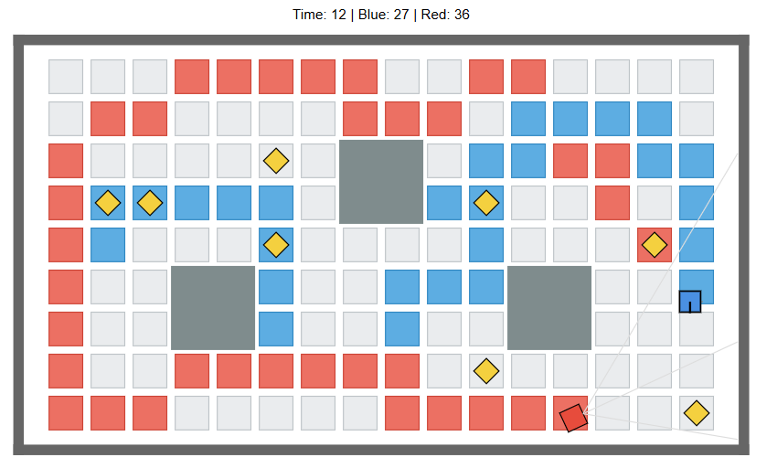

# Paint the Floor



## Overview

Paint the Floor is a two-agent territory control game built with Enviro/Elma. The arena is divided into a grid of floor tiles, with walls and static obstacles placed inside the map. The player controls the **Blue** bot, while the **Red** bot is an autonomous opponent.

As the bots move over the map, they paint tiles in their own color. A painted tile can be taken back by the other side later, so the score changes throughout the round. The goal is to control more tiles than the opponent before time runs out.

Each round lasts **40 seconds**. The HUD shows the remaining time and the current scores for Blue and Red. When the timer reaches zero, the game ends and displays **Blue Wins**, **Red Wins**, or **Tie**. The game also includes **8 hazards** placed at random valid positions. Touching a hazard freezes the bot for **2 seconds**.

This project was built in `klavins/enviro:v1.6`.

## Game Rules

- The arena floor is divided into a fixed grid of tiles.
- **Blue** is controlled by the player using **WASD**.
- **Red** moves automatically and uses **range sensors** for obstacle avoidance.
- When a bot moves onto a tile, that tile becomes that bot’s color.
- Tiles can be repainted by the other bot later.
- **Blue score** = current number of blue tiles.
- **Red score** = current number of red tiles.
- There are **8 hazards** on the map.
- If Blue or Red touches a hazard, that bot is frozen for **2 seconds**.
- Each hazard refreshes independently every **5 seconds**, and it also relocates immediately after being triggered.
- Each round lasts **40 seconds**.
- When the timer ends:
  - If Blue has more tiles, **Blue Wins**
  - If Red has more tiles, **Red Wins**
  - If scores are equal, **Tie**
- The **Restart** button starts a fresh round.

## Project Structure

```text
Paint_the_Floor/
├── config.json
├── defs/
├── src/
├── lib/
├── Makefile
└── README.md
```

## Installation and Running

Assuming Docker is already installed, start the Enviro container first.

### macOS / Linux

```bash
docker run -p80:80 -p8765:8765 -v $PWD:/source -it klavins/enviro:v1.6 bash
```

### PowerShell

```powershell
docker run -p 80:80 -p 8765:8765 -v ${PWD}:/source -it klavins/enviro:v1.6 bash
```

After entering the container:

```bash
cd Paint_the_Floor
```

If you want to rebuild from scratch:

```bash
make clean
make
```

Then start the web server and simulation:

```bash
esm start
enviro
```

After that, open the Enviro page in your browser: **http://localhost**

## How to Use the Project

1. Launch the project with the commands above.
2. Open the simulation in the browser.
3. Control the **Blue** bot with:
   - `W` = up
   - `A` = left
   - `S` = down
   - `D` = right
4. Move over floor tiles to paint them blue.
5. Avoid hazards, because touching one freezes the bot for **2 seconds**.
6. Compete against the **Red** bot, which paints tiles red and uses range sensors to avoid walls and obstacles.
7. Watch the HUD for:
   - remaining time
   - Blue score
   - Red score
8. When the round ends, check the result shown on screen.
9. Click **Restart** to begin a new round.

Main components:
- `blue_bot` — player-controlled omni bot
- `red_bot` — autonomous sensor-based opponent
- `hazard` — moving hazard objects
- `game_manager` — board rendering, scoring, timer, round control, and restart logic

## Key Challenges and How They Were Addressed

### 1. Building a clean tile grid
At first, the floor tiles behaved like regular agents in the arena, which made the board look messy and physically unstable. To fix this, the board was redesigned as a clean grid managed centrally by the `GameManager`, with tile ownership stored in a grid data structure.

### 2. Layering the display correctly
A major challenge was making the floor feel like a real background instead of a pile of movable objects. The solution was to render the tile board as SVG background graphics from the `GameManager`, while keeping the bots and hazards as **foreground agents**. This created a much clearer visual separation: background for the floor, foreground for moving game objects.

### 3. Hazard collision reliability
Originally, hazard triggering was based on tile occupancy. That worked in many cases, but sometimes a bot could visibly push into a hazard without actually triggering it. To make the interaction more reliable, hazard triggering was changed from **tile-based checks** to **distance/contact checks** using the current bot positions. This made hazard behavior match the visible collision much better.

### 4. Independent hazard timing
At first, all hazards shared one refresh timer. If one hazard moved, the timing for all of them was affected. This was changed so that each hazard maintains **its own timer**, which makes the system more natural and avoids unnecessary coupling between hazards.

### 5. Preventing board drift
Because the board and HUD were attached to the `GameManager`, collisions near the center of the map could cause the whole board to shift visually. This was fixed by moving the `GameManager` body to an **off-screen anchor point** and drawing the board and HUD using translated SVG. That kept the board stable while removing unwanted collision effects.

### 6. Red bot getting stuck in corners
The Red bot originally had a basic obstacle avoidance rule, but it could get trapped for a long time in corners or narrow areas. To address this, a simple **escape behavior** was added: when the front, left, and right sensors all detect nearby obstacles, the bot treats the situation as a tight corner, **backs up briefly**, then **forces a turn**, and only then resumes forward movement.

### 7. Improving Blue bot controls
Blue originally used a robot-style control model with turning and forward/backward motion. That worked, but it did not feel ideal for a territory control game. Blue was later changed to **smooth omni-directional WASD control**, which made movement much more natural for a player-controlled character while still fitting the rest of the game.

### 8. Difficulty tuning
The overall balance of the game required repeated testing and tuning. This included the number of hazards, hazard refresh timing, Blue movement speed, and the general pacing of the round. These values were adjusted through repeated playtesting until the game felt more active and competitive.

## Sources and Acknowledgements

This project was built mainly from course materials and Enviro examples, especially:

- **Lecture 8** material on events, state changes, and interactive behavior
- **Lecture 9** material on Enviro agents, configuration, movement, sensors, and simulation structure

Additional guidance came from:
- the Enviro/Elma project structure demonstrated in class
- the final project requirement notes and examples
- standard C++ and Enviro usage patterns discussed during the course

No external game engine was used beyond the provided Enviro framework.

## Demo
[paint the floor Demo](demo.mp4)

Possible future improvements include:

- stronger Red bot strategy beyond reactive avoidance
- smarter territory targeting
- randomized bot spawn positions
- more map layouts or random obstacle generation
- additional hazard types
- improved visual polish
- better balancing between player mobility and Red bot behavior

## License

This software is open source and uses the MIT license.